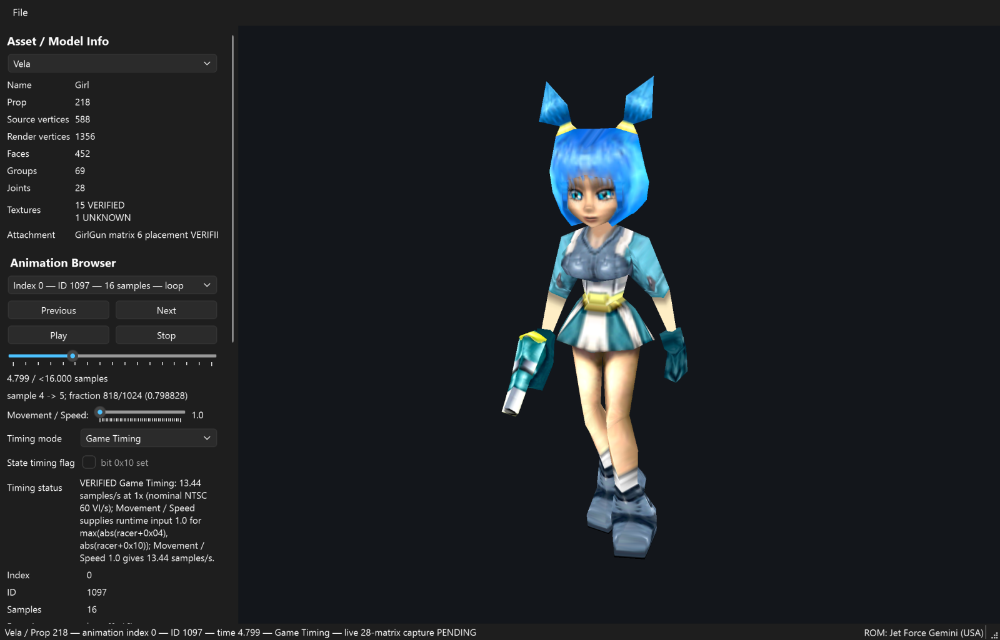
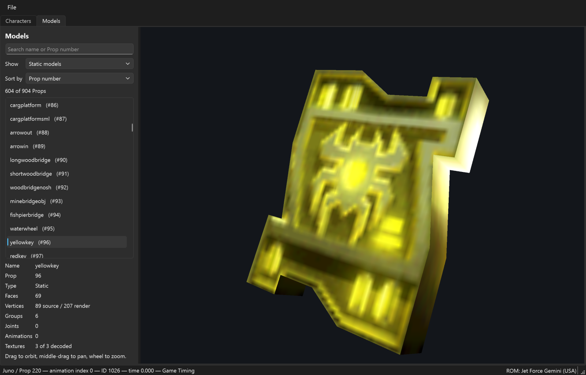
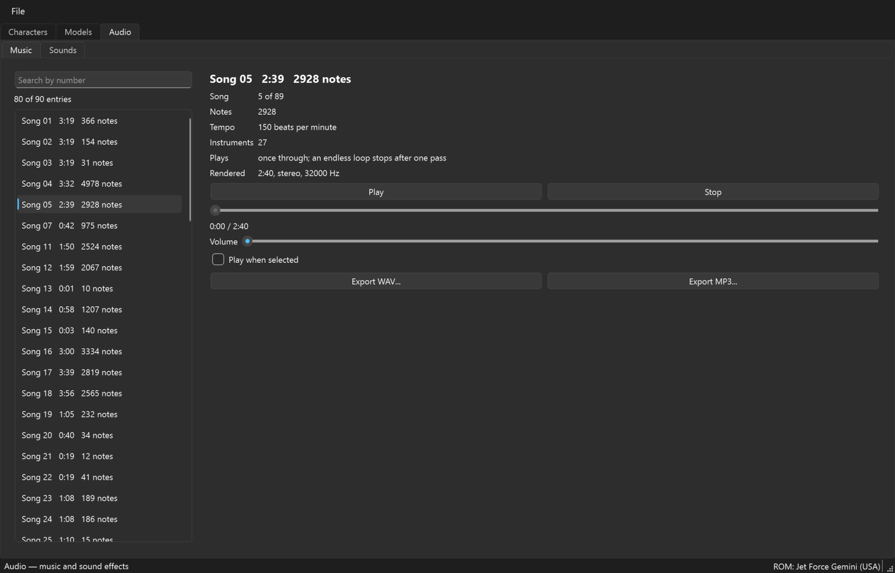
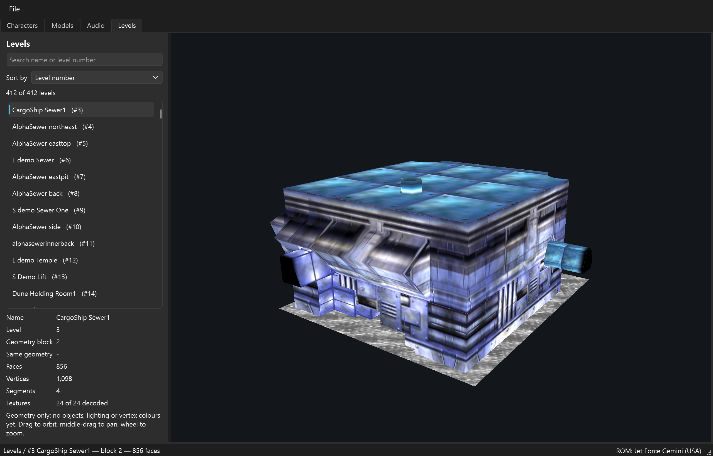
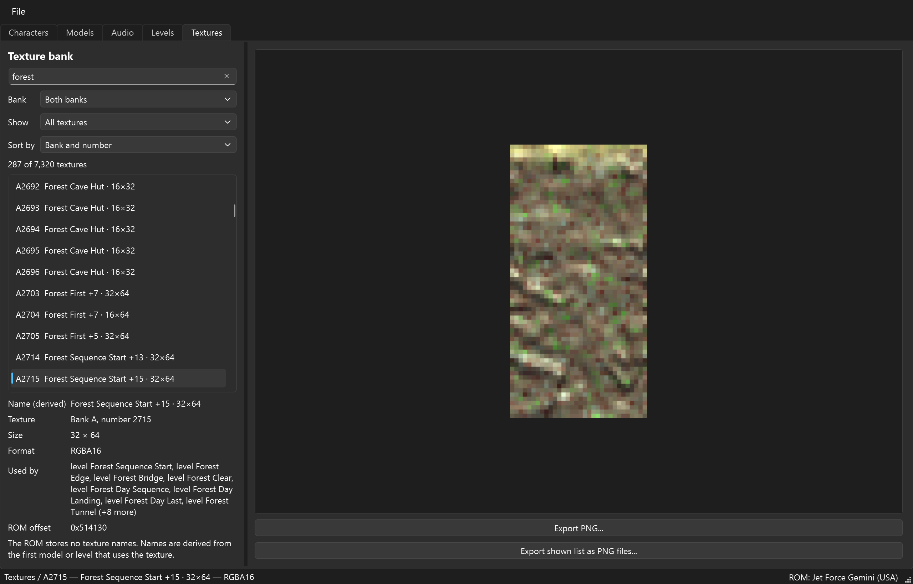

# JFG Forge

JFG Forge is a Windows desktop viewer and glTF exporter for the models of
*Jet Force Gemini* (Nintendo 64, US release). You load your own ROM, pick a
character, watch its animations with the game's own timing, put a weapon in its
hand, and export the model or animation to glTF for Blender and other tools. A
second tab, **Models**, lets you browse the game's static models (keys, doors,
platforms, weapons and hundreds more) with their textures and names, and a
third tab, **Audio**, plays and exports the game's music and sound effects. A
fourth tab, **Levels**, shows the textured geometry of the game's levels, and a
fifth, **Textures**, is a texture bank with previews, derived names and PNG export.



*JFG Forge with Vela selected: the textured, animated model in the 3D view, and
the model info, animation browser, timing and attachment controls on the left.*



*The Models tab: a searchable list of the game's models, here the Yellow Key.*



*The Audio tab: the game's songs and sound effects, with playback and WAV/MP3 export.*



*The Levels tab: 412 named levels, each shown with its textures.*



*The Textures tab: the game's 7,320 textures with previews and PNG export.*

**No game ROM and no game assets are included.** You need your own legally
obtained US ROM. See [Legal](#legal).

## Quick start (Windows)

1. Install [Python 3.12 or newer](https://www.python.org/downloads/). On the
   first installer page, tick **Add python.exe to PATH**.
2. Get JFG Forge: on this GitHub page choose **Code, then Download ZIP**, and
   unpack it. (With git: `git clone https://github.com/marvelmaster/JFG-Forge`.)
3. Double-click **`start_forge.bat`**. The first start creates a private Python
   environment and downloads the three libraries JFG Forge needs, which takes a
   minute or two. Later starts open the window right away.
4. In the window choose **File, then Load ROM...** and select your ROM.

If something goes wrong, see [docs/troubleshooting.md](docs/troubleshooting.md).

Manual start, if you prefer a terminal:

```powershell
py -3 -m venv .venv
.venv\Scripts\python.exe -m pip install -r requirements.txt
.venv\Scripts\python.exe -m jfg_forge --rom C:\path\to\your\rom.z64
```

`--rom` is optional. Without it the window opens and asks for the ROM.

## Required ROM

| Property | Required value |
|---|---|
| Region | US |
| Format | Z64 (big-endian) |
| Size | 33,554,432 bytes |
| SHA-1 | `493ced9008dbe932d6e91179b68e8630cf23a023` |

The file name does not matter. JFG Forge checks the size, the byte order and
the full SHA-1 before it loads anything, and it only reads the file: your ROM is
never copied, changed or uploaded. V64/N64 (byte-swapped) files and other
revisions are rejected. The ROM path is not remembered between starts.

## What you can do

- **Pick a character** from the grouped list at the top of the left panel. Each
  model loads the first time you select it.
- **Browse animations** with Previous/Next (or Ctrl+Left / Ctrl+Right), play and
  stop them, and scrub through the frames.
- **Choose the timing**: *Game Timing* plays each animation at the speed the
  game uses, *Technical* plays one sample per second. The Movement / Speed
  slider (1.0 to 5.0) stands in for how fast the character is moving.
- **Equip a weapon**: pick one of nine hand-and-weapon models under the
  character's attachment list.
- **Inspect the rig**: show the mesh, the skeleton, or both, and select a joint
  to see its position and which geometry it moves.
- **Export** through **File, Export**: the model, the current animation, or
  both, as glTF 2.0 with PNG and binary side files.
- **Browse models** in the **Models** tab: search all 904 props by name or
  number and look at any of them with its textures. See
  [docs/models.md](docs/models.md).
- **Listen** in the **Audio** tab: play the game's songs and its 637 sound
  effects, and export any of them as WAV or MP3. See
  [docs/audio.md](docs/audio.md).

In the 3D view, drag with the left mouse button to orbit, drag with the middle
button to pan, and use the mouse wheel to zoom. The
[usage guide](docs/usage.md) walks through every control.

## Supported characters

21 models in three groups. The drop-down at the top of the left panel of the
Characters tab lists them; each one loads the first time you pick it.

| Group | Entries | Rig | Game Timing | Weapons |
|---|---|---|---|---|
| Campaign | Juno, PowerBoy, Vela, PowerGirl, Lupus, PowerDog | 21, 21, 28, 28, 27 and 18 joints | VERIFIED | 9 per character, VERIFIED |
| Multiplayer characters | Green Ant, Red Ant, Tribal Man, Shield Bug, Stag Bug, Weevil, Cyborg, Zombie | 21 joints (Juno's layout) | LIKELY (Juno's table) | Juno's 9, LIKELY |
| | Blue Ant, Yellow Ant, Tribal Woman | 28 joints (Vela's layout) | LIKELY (Vela's table) | Vela's 9, LIKELY |
| Hover ships | Yellow, Red, Blue and Green Ant Ship | 8 joints, 2 animations | UNKNOWN (Technical) | none |

**VERIFIED** means the value comes straight from ROM data and game code that was
checked. **LIKELY** means the evidence is strong but no runtime capture confirms
it. [docs/characters.md](docs/characters.md) lists every model with its Prop
number and explains both labels.

## Models tab

The **Models** tab lists every model in the ROM by the name the game gives it.
By default it shows the 604 static models. Two other filters show the 284
animated props (drawn in a rest pose) and all 904 entries, including a few empty
helper models. Type a name or a Prop number into the search box, pick a model,
and orbit around it with the mouse. Each model shows its faces, joints,
animations and how many of its textures Forge could decode. Details and limits
are in [docs/models.md](docs/models.md).

## Audio tab

The **Audio** tab has two segments. **Music** lists the game's 80 songs; **Sounds**
lists its 637 sound effects. Pick an entry and press Play (sound effects can also
play as you select them), set the volume, and use **Export WAV...** or
**Export MP3...** to save it. Songs are rendered from the game's own sequence
and instrument data, so they sound close to the game but not identical. Details
and limits are in [docs/audio.md](docs/audio.md).

## Levels tab

The **Levels** tab lists the game's 412 named levels. Pick one to see its
textured geometry and orbit around it. Objects, lighting and vertex colours are
not shown yet. Details and limits are in [docs/levels.md](docs/levels.md).

## Textures tab

The **Textures** tab is a texture bank of all 7,320 textures. Search, filter and
sort them, see which models and levels use each one, and export one or many as
PNG. The ROM has no texture names, so names are derived from usage and marked as
such. Details and limits are in [docs/textures.md](docs/textures.md).

## Project layout

```
jfg_forge/
  __main__.py       starts the application (python -m jfg_forge)
  core/             ROM validation, prop bank, model and texture decoding,
                    animation and timing data, scenes, glTF export
  gui/              the Qt/OpenGL window, playback, export menu
docs/               usage guide, characters, models, audio, levels and textures tabs, glTF
                    export, technical notes, troubleshooting
licenses/           third-party software notices
start_forge.bat     one-click launcher for Windows
requirements.txt    Python libraries (NumPy, PyOpenGL, PySide6, lameenc)
```

## Limitations

- The Characters tab opens the 21 models above. The other props are only
  browsable in the Models tab, as still pictures: no animation, no weapons and no
  export yet. The six multiplayer versions of Juno, Vela and Lupus are not in the
  Characters tab.
- The texture decoder handles the formats these characters use (RGBA32,
  RGBA16, IA8 and one multi-image RGBA16 layout). Others are shown as unknown;
  none of them is drawn on any of the 21 characters, but 67 props in the Models
  tab have a part that shows grey for this reason.
- Animation numbers are technical IDs. They have no gameplay names unless that
  was verified.
- The Movement / Speed slider is a preview input, not a live game value.
- glTF exports approximate the game's decal layering, and skinned vertex
  weights are not written (each vertex follows one joint, as in the game).
- Songs are an approximation of the console's synthesizer: no reverb, chorus
  or sustain pedal, and pitch bends apply only at the start of a note. Sound
  effects and songs have no known names, only numbers.
- The viewer needs an OpenGL 3.3 capable graphics driver.
- Tested on Windows 11. Other systems are untested.

## Legal

JFG Forge is an unofficial, non-commercial fan project. It is not affiliated
with or endorsed by Nintendo or Rare. *Jet Force Gemini* and its content belong
to their rights holders. This repository contains no ROM and no extracted game
data, and you must not add any.

Music and sound effects you export come from the game's ROM. Keep them for
your own use and do not redistribute them.

The JFG Forge source code and documentation are licensed under the
[MIT License](LICENSE). Third-party libraries are listed in
[licenses/THIRD_PARTY.md](licenses/THIRD_PARTY.md).
